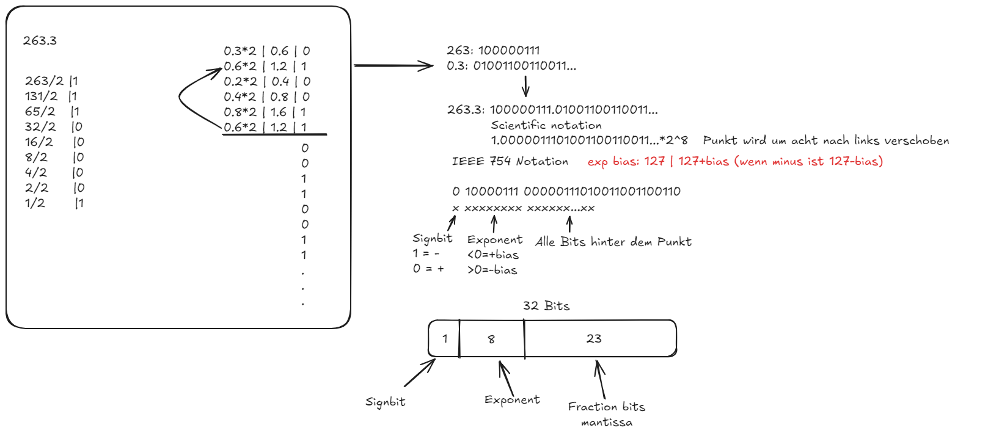
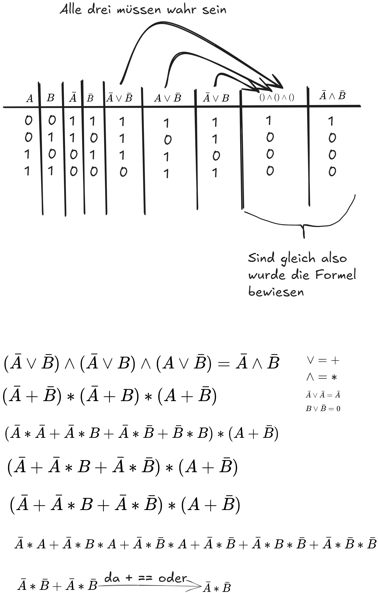

== Useful basics
:nofooter:
:stem: asciimath

*	Zahlensysteme
**	Dezimal, Hexadezimal, Dual (Umwandlung, Darstellung, Grundrechenarten) ✓
**	Darstellung von negativen Zahlen in Binär/Hexadezimal (Singed-Bit, Einer- und Zweierkomplement) ✓ 
**	Floating-Point Zahlen nach IEEE 754 ✓
*	Digital Technik
**	Boolsche Algebra (Grundverknüfpungen) ✓ 
*	Microcontroller Architektur
**	Harvard vs. Von Neumann
**	Speicher (RAM/Flash)
**	Memory Map Allgemein
**	Befehlsausführung und Register | Nochmal richtig anschauen
*	STM32G070/STM32F103
**	Memory Map 
**	Cortex-M0/M3
**	ARM Assembly
**	ARM ABI

exponent nach standard nachschauen

=== Hex in Dezimal

|===
|Dezimal | Hex
|1
|1
|2
|2
|3
|3
|4
|4
|5
|5
|6
|6
|7
|7
|8
|8
|9
|9
|10
|a
|11
|b
|12
|c
|13
|d
|14
|e
|15
|f
|===

Dezimal 18 = Hex 12

|===
|Durch 16 | Quotinet(aufgerundet) | Rest | Index
|18
|1
|2
|0
|1
|0
|1
|1
|===

Hex 12 = Dezimal 18

[stem]
++++
(1 * 16^1) + (2 * 16^0) = 18

(x_n*16^n) ... + (x_(n-n)*16^(n-n))
++++

n = Anzahl an Hex zahlen zur umrechnung +
x = Hex zahl in dezimal

Eine hex zahl = 4 bits +
4 = 0100 +

''''
=== Dualsytem / Binärsystem
* Gibt nur zwei Ziffern 0 und 1
* Ein bit kann nur einen Wert haben (0/1)
* 1 Byte = 8 bit

image:img/DezimalRechnung.png[]

|===
|durch 2 | Rest/bit | wert
|1
|1
|64
|2
|0
|32
|5
|1
|16
|10
|0
|8
|20
|0
|4
|40
|0
|2
|80
|0
|1
|===

==== Rechenarten
==== Addieren:
----
    1011
   +0110
   10001

    1110
   +1100
   11010
----
==== Subtrahieren

==== Multiplikation

==== Dividieren

''''
=== Zweierkomplement
Möchte man eine Minus Zahlbinär darstellen so wird das Zweierkomplement benutzt.

-8:

----
00001000 = 8 Zahl in binär (positiv)
11110111 Zahl invertiert

11111000 zweierkomplement = invertierte zahl plus 1

11111000

00000111 = 7 plus 1 invertiert vom zweierkomplement
00001000 = 8 Zahl in binär (postiv)
----

-12:

----
00001100
11110011
11110100

00001011 = 11 | plus 1
00001100 = 12
----

=== Fließkommazahlen / IEEE 754

float = 32 bit

=== Digital Technik
==== Bool`sche Algebra
stem:[(\bar{A}vv\bar{B})^^(\bar{A}vvB)^^(Avv\bar{B})=\bar{A}^^\bar{B}]

stem:[vv] == Und +
stem:[^^] == Oder

=== Microcontroller Architektur
==== Harvard vs Neumann
===== Neumann
* Hat nur einen Systembus
* Besteht aus:
** Eingabewerk
** Speicherwerk
** Rechenwerk
** Steuerwerk
** Ausgabewerk
* Struktur eines Rechners ist unabhänig von der Problemstellung (Also welche Aufgabe er übernehmen soll (Speicherprogramierbar))
* Im Speicher werden die Programme und Operanden (Daten und Variablen) abgelegt
* Speicher wird in Fortlaufend nummerierte Zellen von gleicher Größer eingeteilt
* Daten, Befehle, Adressen und Steuerungen werden binär codiert
* Ein Programm ist einfach eine Folge von Anweisungen

Es geht darum einen PC universal zu machen (Speicherprogrammierbar)

* +Geringer Hardwareaufwand = geringere Kosten
* +geringerer Speicheraufwand

image:img/neumanVsHarvard.png[]

==== Speicher RAM/Flash
SRAM
* schneller als DRAM
* =>kürzere Zugriffszeit
* Verwendet Transistoren und Latches
* Vebraucht weniger energie als DRAM
* Hat weniger Speicher kapazität als DRAM

DRAM
* Benutzt Kondensatoren und wenige Transistoren
* Muss refreshed werden um die Daten nicht zu verlieren
* Langsamere lese Zeit

==== Memory map Allgemein
Eine Memory map beschreibt die Nuztzungsweise des Speichers.

Ein MMU sorgt dabei dafür Teile des Speichers zu reservieren um Software in geschützten Bereichen ablaufen lassen zu können. Sonst könnte es sein das laufenede Applikationen sich gegenseitig überschreiben würde.

==== Befehlsausführung und Register
Ein Befehlszyklus besteht immer aus drei Operationen die der Prozessor durchläuft. +
Fech -> Decode -> Execute +
Dabei gibt es einen Programme Counter, Instruction Register und Accumulator für die Speicherung von einem Wert.
Der Programme Counter bekommt die Adresse des RAMS welche den ersten/akutellen Schritt an instruction enthält. Dieser wird automatisch erhöht nach Ausführung des Befehls, so dass der nächste Befehel/Instruction
ausgeführt werden kann. +
In dem Instruction Register werden die Instructions die Ausgeführt werden sollen geschrieben.

Hier sieht man Beispielsweise einen Solchen zyklus. Im Moment ist der Programme counter,das Instruction Register und der Accumulator noch nicht gesetzt. Wird jetzt der Prgramme Counter auf die Adresse der ersten Instruction im RAM gesetzt wird diese erst ins Instruction Register geschrieben, dann decodiert und dann Ausgeführt. So ensteht eine loop in die der Wert der Adresse 6 um die Adresse 7 also um eins erhöht wird.

Register sind eine Art Speicher welche dirct in den Prozessor mit eingebaut sind (desswegen ist das auch die Schnellste Art Daten zu speichern). Es wird für die speicherung und manipulation von daten während der Ausführung von instructions benuzt. Ein Register kann eine instruction, eine storage address oder auch irgend eine Art an Daten speichern.

Für die Speicherung werden, innerhalb eines Registers flip-flops benutzt, welche entweder 0 oder 1 representieren. Die Größe Variert, normalerweise, dabei zwischen 8bit und 64 bit. +
Es gibt viele verschiedene Arten von Registern.

* **Program Counter(PC)** Beinhaltet die Adresse der nächsten instruction
* **Instruction Register(IR)** Beinhaltet die fetched instructions die Ausgeführt werden
* **Accumulator (ACC)** Ist ein general-purpose register was für arithmetic und logische operationen benutzt wird um zwischen durch ergebnisse von Rechnungen zu speichern
* **General-Purpose Register(R0,R1...)** Das sind Register, welche für das Speichern von daten vom Programmierer frei genutzt werden können
* **Address Register(AR)** Address Register speichern daten addressen für das Zugreifen oder verschieben von Daten in andere Speicher adressen
* **Stack Pointer(SP)** Zeigt auf den obersten im Stack, was eine region an Speicheradressen ist welche für die temporäre Speicherung von Daten benutzt wird
* **Data Register(DR)** Speichert Daten die von dem Memory gefetched wurden oder von input/output operations kommen
* **Status Register/Flags Register(SR)** Die Register enthalten bits welche ein bestimmten Status von operationen zeigen: overflow, zero result.... Dies hilft dabei Programme basierten auf davor ausgeführte Aktionen zu erstellen.
* **Control Register(CR)** Managet verschiedenste Einstellungen und parameter welche das Verhalten der Cpu verändern.

https://www.totalphase.com/blog/2023/05/what-is-register-in-cpu-how-does-it-work/[was sind Register]

=== STM32G070/STM32F03
==== Memory Map
[%autowidth cols="a,a",frame=none,grid=none,role="center"]
|===
| 
| image:img/memoryMapDetail.png[]
|===

==== Cortex-M0/M3
Arm selber stellt keine Prozessoren/Controller her sondern entwickelt nur "IP-Cores". Lizensierte Hersteller ergänzen dann den Core um Speicher und Peripherie. Der Vorteil dadurch ist, dass es viele Prozessoren mit unterschiedlichster Ausstattung verfügbar sind, die alle mit dem selben Befehlssatz programmierbar sind.

Es gibt einen 32 Bit Befehlssatzt aber auch einen Thumb Befehlssatz der bis auf einige Ausnahmen alle Befehle in 16bit codiert. Dadurch wird das Instruction-Set aber auch langsamer ausgeführt. Die Cortex-M controller können ausschließlich Thumb-Instruktionen ausführen.

Der M0 ist eine günstige und Energie-effiziente Variante und hat im Vergleich zu dem M3 einen duetlich kleineren Befehlssatz

Der M3 hingegen ist ein guter allrounder unter den Cortex-Ms

==== ARM Assembly
==== ARM ABI
