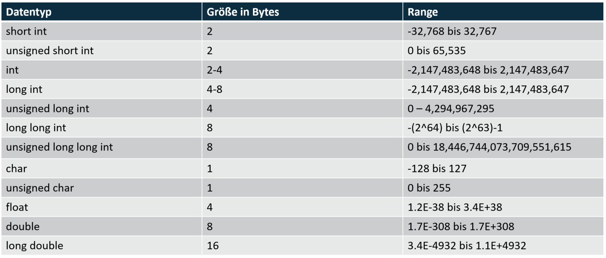

== Datentypen:

short int = 2
int = 2 bis 4 | abhänig vom system
long int = 4

== Operatoren und Kommentare

=== Kommentar:

[source,c]
----
/*
kommentar
für mehrere zeilen
 */
 // für eine zeile
----
=== Arithmetische Operatoren
[source,c]
----
+ oder var++ //für addition bzw. Inkrementierung
5+2 = 7 | 5++ = 6
- oder var-- //für subtraktion bzw. Dektementierung
5-2 = 3 | 5-- = 4
% //für modulo
4 % 5 = 4
/ //zum teilen
10 / 5 = 2
* //zum multiplizieren
5*5 = 25
//WICHTIG
int ii = 6;
--ii; //prefix
ii--; //postfix
int i = --ii; //i hat den wert 5
int i = ii--; //i hat den wert 6, da erst zugewiesen wird dann der operator ausgeführt wird
----
=== Zuweisungsoperatoren
[source,c]
----
+=
-=
*=
%=
&= //bitwise operator
|= //bitwise operator
^= 
<<=
>>=
nur mit variablen also:
int i = 5,ii = 5;
i += 5; //funktioniert
i += ii; //funktioniert
5 += 2  //funktioniert nich, weil der 5 ja keinen neuen Wert zugeordnet werden kann da es keine variable ist
----

=== Vergleichsoperatoren
[source,c]
----
< kleiner
<= kleiner gleich
> größer
>= größer gleich
== gleich
!= ungleich
----

=== logische operatoren 
[source,c]
----
&& //logischer AND operator
|| //logischer OR operator
!  //logisches nicht
int x = 10;
int y = 15;
if(x == 10 && y == 15)
{
    printf("wird ausgegeben");
}
if(x == 5 || y == 15)
{
    printf("wird ausgegeben");
}
x = 1; //1 steht für true, 0 für false
if(!x)
{
    printf("wird nicht ausgegeben");
}
----

=== bitwise operatoren
[source,c]
----
A = 0011 1100
B = 0000 1101
& Kopiert die bits die gleich sind und setzt die ungleichen auf 0
A&B = 0000 1100
| kopiert bits wenn sie bei einem operand exestieren
A|B = 0011 1101

^ wenn die bits gleich sind wird 0 kopiert sonst 1
A^B = 0011 0001

~ flipt alle bits
~A = 1100 0011
<< schiebt alle bits nach link um die angegeben zahl
a << 2 = 1111 0000
>> schiebt alle bits nach rechts um die angegeben Zahl
a >> 2 = 0000 1111
----

== Variablen
Eine variable ist ein mit Namen versehener Speicherbereich, in dem Daten eines bestimmten Typs hinterlegt werden können. Macht man es nicht selber wird der Speicherplatz vom compiler vergeben.
[source,c]
----
Typ Namen
int testV; //Variable ist nur definiert aber noch nicht initalisiert, dass heißt sie haben noch keinen Wert zugewiesen bekommen
int testV,another;
int testV = 1,another = 10; //mit zugewiesenem Wert

Namen   Wert
testV = 1024
----

const sorgt dafür dass eine variable nur lesbar ist (read-only)

== Typkonvertierung
Mithilfe des type casting in c kann man einen Datentyp in einen anderen umwandeln, damit diese besser zusammen funktionieren
[source,c]
----
int i = 10;
float ii;
ii = (float)i;
----

* Umwandlung von einem kleineren in einen größeren Datentyp nennt man promotion
* Implicit type conversion ist wenn der Compiler dafür sorgt dass Datentypen automatisch konvertiert werden
* befolgt man die Reihenefolge nach größe der Datentypen wird das Konvertieren automatisch übernommen bzw. ist automatisch möglich
* Explicit type conversion benötigt einen casting operator

[source,c]
----
//implicit type conversion
int i = 10;
float ii = i; //wird automatisch umgewandelt
//explicit type conversion
float i = 3.5;
int ii = i //nicht möglich
int ii = (float)i; //funktioniert da man explicit angibt das der Datentyp umgewandelt werden soll
----

== Statements
Statements sind wichtig für den Ablauf und die Logik des Programms.

=== goto und labeled-statements:
[source,c]
----
statement:
    jump-statement //goto
        goto identifier;
    labeled-statement
        identifier : statement;
*/
#include <stdio.h>
int main()
{
    for (int i = 0; i < 10; i++)
    {
        if (i == 5)
        {
            goto stop;
        }
    }
    printf("Loop exited without going to stop\n"); //wird nicht ausgeführt

    stop: printf("stopped i = 5\n");
}
----

=== jump-statement:
[source,c]
----
/*
iteration-statement
    jump-statement

iteration-statement
    statement
        jump-statement
*/
for(int i = 0;i < 10;i++){
    if(i == 10){
        break;    // bricht die schleife ab
        continue; // Überspringt die iteration ab hier
        goto identifier;     // springt zum angegebenen Identifier
    }
}
----

=== iteration-statement
[source,c]
----
#include <stdio.h>
/*
iteration-statement
    do statement while (expression);
    while (expression) satement
    for (init-expression;cond-expression;loop-expression) satement
*/
int main()
{
    do
    {
        printf("Das wird ausgeben");
    } while (1 == 2);

    while (1 == 2)
    {
        printf("Das wird nicht ausgegben");
    }

    for (int i = 0; i < 10; i++) //bei intiliasierung;condition;bei jeder Iteration
    {
        if (i == 5)
        {
            break;
        }
    }
}
----

=== selection-statement
[source,c]
----
/*
selection-statement
    if(expression) statement
    if(expression) statement else statement
    switch(expression) statement
*/

#include <stdio.h>
int main()
{
    if(1 == 1){
        printf("das wird ausgegeben\n");
    }
    else
    {
        printf("das wird nicht ausgegben\n");
    }
}
----

=== switch und labeled-statements
[source,c]
----
/*
    selection-statement
        switch(expression) labeled-statement // case und default
    labeled-statement
        case constant-expression : statement // ende mit break makieren
        default: statement                   // ende mit break makieren
*/
#include <stdio.h>
int main()
{
    int expression = 1;
    switch (expression)
    {
    case 1:
        printf("wird ausgegeben\n");
        break;
    
    default:
        printf("wird nicht ausgeben\n");
        break;
    }

}
----

=== expression-statement
/*
expression-statement
    expression; // eine Leere expression nennt man Null statement
*/
* Bestehen aus symbolen,nummern, text die ein bestimmten ergebniss erzeugen 
* man unterscheided zwischen Arithmetic, Relational, Logical und Conditional Expressions

=== compound-statement

ein compound-statement (auch block genannt) wird normalerweise als body für ein anderes statement benutzt. Z.b das if statement

[source,c]
----
#include <stdio.h>
/*
compound-statement
    { declaration-list statement-list }
declaration-list
    declaration
    declaration-list declaration
statement-list
    statement
    statement-list statement
*/
int main()
{
    if (1 == 1)
    {           //begin of compound statement
        int t = 1;
        for (int i = 0; i < 10; i++)
        {
            printf("%i\n",i);
        }
    }           //end
}
----

=== Expression

=== Arithmetic Expression +
Arithmetic Expressions beinhalten das benutzen von mathematischen operatoren mit den Typen int, float oder double.

=== Relational Expressions +
Relational Expressions benutzen die Vergleichsoperatoren z.B > um zwei operands zu vergleichen. Das ergebnis des Vergleiches ist dann 0 für false oder none-zero für true
[source,c]
----
a!=b
a+b == x+y
----

=== Logical Expressions +
Eine logical Expression kombiniert mehrere relational expressions. Die expression entscheided ob eine bestimmtes statement oder statement Gruppe ausgeführt werden soll.

=== Conditional Expression + 
Besteht aus drei Expressions: Expression1 ? expression 2 : expression 3

== Storage classes
Was sind Storage classes ?
Storage classes beschreiben eigenschaften von variablen und funktionen bezüglich ihrer Zugänglichkeit, lebenslänge und scope(Gültigkeit).

=== Welche gibt es ?
==== auto
Auto ist die Standard storage class für variablen innerhalb einer funktion oder eines Blocks.
Auto variablen sind Lokal in der Funktion und können somit nur in dieser Benutz werden.
Benutzt man pointer außerhalb des scopes der Variable funktioniert das nicht, da diese an der bestimmten speicherstelle nicht mehr exestiert.
(wenn die funktion vorbei ist wird auch der speicherplatz für die Lokalen variabeln in der Funktion wieder freigegeben)
Variablen die mit auto erstellt werden bekommen auch einen garbage Wert also einen Zufälligen müll wert, da beim erstellen der Variable bereits Speicherplatz für die Variable reserviert wird.

==== extern
Extern sagt einfach nur, dass die Variable irgendwo nur nicht im Block definiert wurde. Hauptsächlich wird extern für Variablen benutzt welche in mehreren Files benutzt werden.

==== static
Static wird benutzt um eine Variable bis zum ende des Programms zu behalten. (Speicher wir nicht freigegeben)
Wenn man in einer Funktion einen Pointer zu einer static variable zurrückgibt kann man selbst nach Ablauf der Funktion noch auf diese Zugreifen.
Das wäre bei einer normalen lokalen Variable nicht der Fall.

==== Register
Register wird benutzt, wenn man eine Variable in dem Cpu register des processors/microprocessor speichern möchte, da das Zugreifen auf diese Variablen deutlich schneller ist. Wenn kein speicher frei ist werden diese Variable in den memory gespeichert. Wie beim speicher bekommt der Speicher einen garbage wert, wenn nicht bei der erstellung ein Wert direkt zugeordnet wird.

== Pointer
Speichert die Speicheradresse einer Variable.

=== Arithmetik
* Inkrementierung
* Dekrementierung
* Addition
* Subtraktion
* Vegleichen
[source,c]
----
#include <stdio.h>
int main()
{
   int a=60,b=13,*ptr=&a;
   printf("first num: %i\n",*ptr);
   printf("second num: %i\n",*++ptr);
}
----
Funktionert, da die Speicher adressen der Variablen hintereinander liegen (weil die im Stack gespeichert werden) und man einen pointer kann einfach _+_ rechnen kann, um auf die nächste speicher adresse

== null statement
Ist ein expression statement mit einer fehlenden expression.
Ist sinvoll, wenn der Syntax eine expression fordert man aber keine braucht/ benutzen will
werden auch als platzthalter benutzt

return bei if, while , for
null statement

== memory layout of c programs

=== 1. Text/code segment
* Speichert den die compilierten program instructions
* Read-only
* hat eine niedrigere speicher adresse, damit diese von dem stack und heap nicht überschrieben wird

=== data segment
2. Initialized data segment
* hier werden globale und satische variablen gespeichert, welche bereits initialisiert sind
* lifetime bis zum ende des Programs
* variablen können geändert werden

3. unitialized data segment (bss)
* hier werden globale variablen gespeichert, welche nicht intizialisiert wurden 
* lifetime ist auch bis zum ende des Programms

4. Heap
* hier werden variablen gespeichert die Dynamisch gespeichert werden wären des Programms z.B mit malloc
* programmierer selber muss sich um den heap speicher kümmern
* kann zu memory leak problemen führen

5. Stack
* variablen werden nach und nach im stack gespeichert
* desswegen kann man mit ++/-- sich durch die variablen bewegen

== struct
Ein struct ist eine user definerter datentyp der aus Einer Gruppe an variablen besteht. Die variablen innerhalb eines structs nennt man member.
Die Werte vom struct werden hintereinander gespeichert, desswegen kann auch pointer arithmetic angewandt werden.

[source,c]
----
#include <stdio.h>

struct test
{
    int i;
    char test;
    int f;
}structVar;
int main()
{
    structVar.i = 10;
    structVar.test = 'a';
    structVar.f = 1;
    printf("%c\n",*(&structVar.i+1));    //0x7ffd4e6ebc4c = 76
    printf("%p\n",&structVar.test); //0x7ffd4e6ebc50 = 80
    printf("%p\n",&structVar.f);    //0x7ffd4e6ebc54 = 84
}
----

== union
Union ist ähnlich wie ein struct nur speichert es die Daten in der gleichen speicheradresse. Das heißt, dass immer nur ein Wert für eine Variable/Member gespeichert werden kann. 
Ein Union hat dabei die Größe des größten members

[source,c]
----
#include <stdio.h>

union test
{
    int i;
    char test;
    float f;
};

int main()
{
    union test unionVar;
    unionVar.i = 10;
    unionVar.test = 'a';
    unionVar.f = 1.0;
    printf("%p\n", &unionVar.i);         // 0x5584abbdb014
    printf("%p\n", &unionVar.test);      // 0x5584abbdb014
    printf("%p\n", &unionVar.f);         // 0x5584abbdb014
    printf("int: %i\n", unionVar.i);     // 1065353216
    printf("char: %c\n", unionVar.test); // ''
    printf("float: %f\n", unionVar.f);   // 1.000000
}

----

== Typedefintion

Alias namen für Datentypen. Besonders hilfreich für struct und union.

[source,c]
----
#include <stdio.h>

typedef union
{
    int i;
    char test;
    float f;
} test, unionType; // dadurch werden keine Variablen erstellt

typedef struct
{
    int i;
} structType;

int main()
{
    test unionVar1;       // nicht union test UnionVar
    unionType unionVar2;  // funktioniert auch
    structType structVar; // nicht struct structType structVar;
}
----

== Quellen
https://www.tutorialspoint.com/cprogramming/
https://www.c-howto.de/tutorial/strukturierte-datentypen/strukturen/typdefinition/
https://www.cs.hs-rm.de/~kaiser/2122_hwpi/5_C-Sprachelemente-handout.pdf
http://www.inf.fu-berlin.de/lehre/WS11/OS/slides/OS_Declarations_in_C_.pdf
https://learn.microsoft.com/en-us/cpp/c-language/statements-c?view=msvc-170
https://www.geeksforgeeks.org/data-types-in-c/