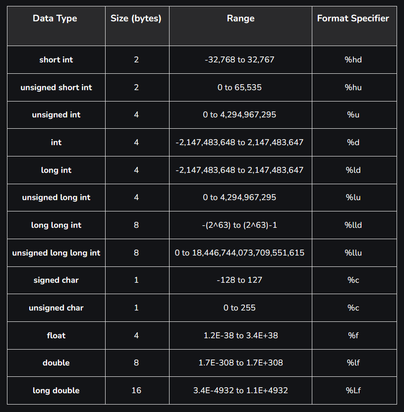

 Header file mit make

 alle c sprachelemente
alle c statements und anweisungen
z.B
if else
while
for

auflistung standard datentypen inclusive größe

programm schreiben dass die Größe der Type ausgibt

gegenüberstellung der storage classes in c

erklärung unterschied globale lokale

grundlagen der pointer arekmetic

c array, c pointer gegenüberstellen

https://www.geeksforgeeks.org/data-types-in-c/

Datentypen:

short int = 2
int = 2 bis 4 | abhänig vom system
long int = 4

Kommentar:
/* 
code snippet
line 2
für mehrere zeilen 
 */ 
 
 // für eine zeile

Operatoren:
+ oder var++//für addition bzw. schnelle addition
- oder var--//für subtraktion bzw. schnelle -1 subtraktion
% //für modulo

