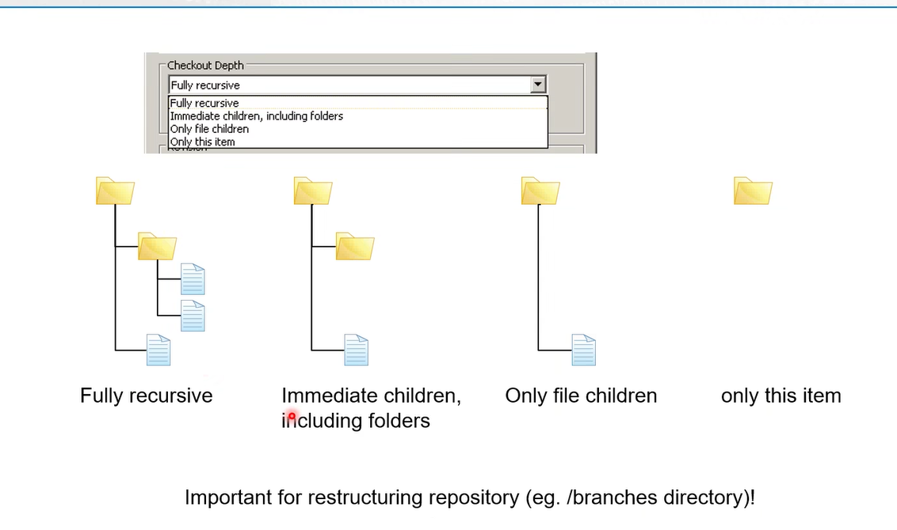
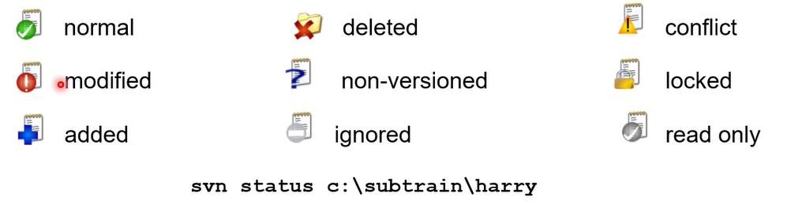
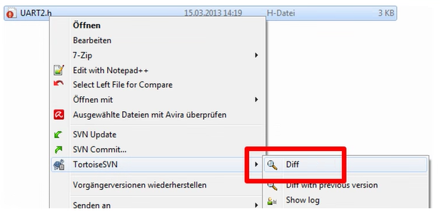
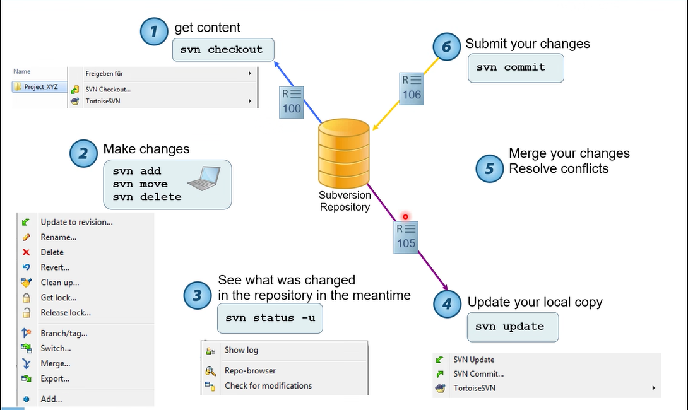
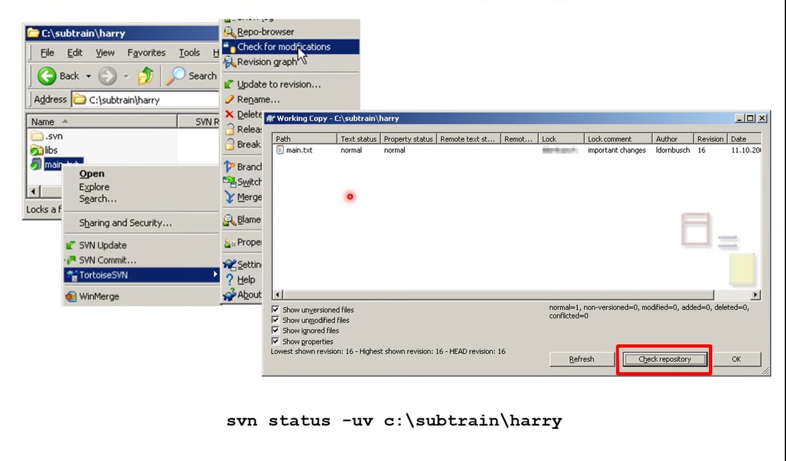
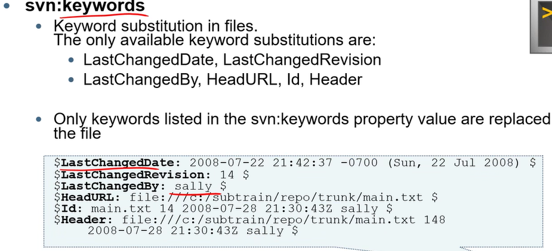

== SVN (subversion) - Grundlagen

=== Was ist Versionverwaltung
* erfassung von änderungen an Dokumennten
* Alle Versionen werden abgespeichert in einem Archiv

* commit
**    ein Objekt das den aktuellen Stand des Projektes festhält. Den Vorgang nenn man auch auc einchecken.

* Checkout
**    Mit einem Checkout kann eine bestimmte Version des Projektes wiederhergestellt werden.

* Working copy
**    Eine lokale Arbeitskopie eines Repository zu einem bestimmten Zeitpunkt

* trunk
**    Haupt Branch

* tags

* branches
**    Verzweigung von dem Repository. Die werden dann später wieder zum ttunk hinzugefügt. 

* Revision
**    änderung am Verzeichniss. 

* Version
**    ist wie ein Tag nur zum export geeignet +

* backup
* collaboration
* documentation
* versioning

== Respository zugriff

* file://
** Für die direkte benutzung über eine lokale datei
* http://
* https://
* svn://
** Ohne authentifizierung
* svn+ssh://

Ablauf:

1: svn checkout, svn update

2: svn add, move, delete

3: svn commit

head immer die letze Revision
svn command:
[source]
----
svn checkout Art:// c:\subtrain\harry

svn checkout file:///C:subtrain c:\subtrain\harry
----

[[example_code]]
[source,bash]
----
svn status <pathToRepo>

svn add <pathToFileToAdd>

svn move <pathFrom> <pathTo> #sonst würde die Datei (für svn) gelöscht und nicht bewegt werden

svn delete <pathToFile>

svn diff <pathToFile>

svn revert <pathToFile>

svn commit -m "<msg>" <pathToRepo>

svn log <pathToRepo> #zeigt an was bis jetzt commit wurde

svn status-uv <pathToLocalRepo> #zeigt änderungen an im vergleich zu neusten revision

svn lock <pathToLocalFile>

svn unlock <pathToLocalFile>

svn status -uv <pathToFile>
----

diff um den Unterschied der datein zu sehen

wenn man in einem team arbeitet sieht der Ablauf wie folgt aus:

=== Locking
copy-edit-merge
* Check out a working copy
* Edit content
* Merge changes from server
* Commit changes
<<example_code, locking command>>

Pessimistic-Locking
propertys für eine file

svn:needs-lock

Datei kann immernur von dem bearbeitet werden der die File gelocked hat

=== SVN property
_svn:ignore_ um eine datei zu ignorieren.

_svn status --no-ignore_ um die ignorierten dateien mit einzubeziehen

==== svn:keywords

==== svn:mime-type
spezifiert ob die datei einfach gemerged werden darf

==== svn:external
für externe repository
_-r <welche revision> <path>_ Revision muss nicht sein

=== Managing versions
Wofür brauch man tags ?
* Mark a release state of a product
* mark a snapshot of the current development

Typische Release namen:
* Release V1.0, Release V1.1, PRODUCT P1.0

svn copy -m "creating release 01" file:///c:subtrain/repo/trunk file:///c:/subtrain/repo/tags/release_01

Ausgehend von nem Tag wird ein Branch erstellt um z.B ein Bug zu fixen und dann einen neuen release gemacht

svn copy -m "creating branch for bugfixing..." <url to tag> <path to destination>

svn switch url path um nicht den aktuellen arbeitsstand commiten zu müssen

=== Merging

=== Subversion Configuration
auto poperties können gesetzt werden

== NTSVN
* Konfigurationsmanagementsystem (bald hoffentlich git)

Unterteilt sich in:
* in das Konfigurationssystem Subversion
* in die Weboberfläche NTSVN
* SVN Client "TortoiseSVN"

link:SVN_User_Training.pdf[]